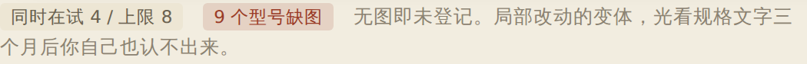
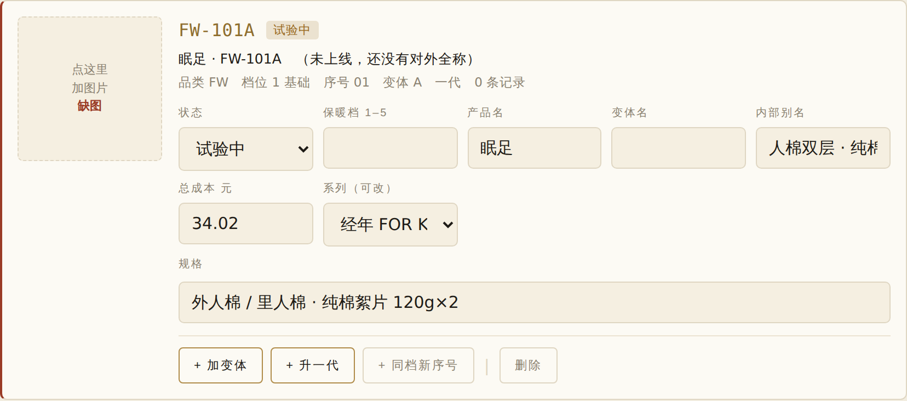
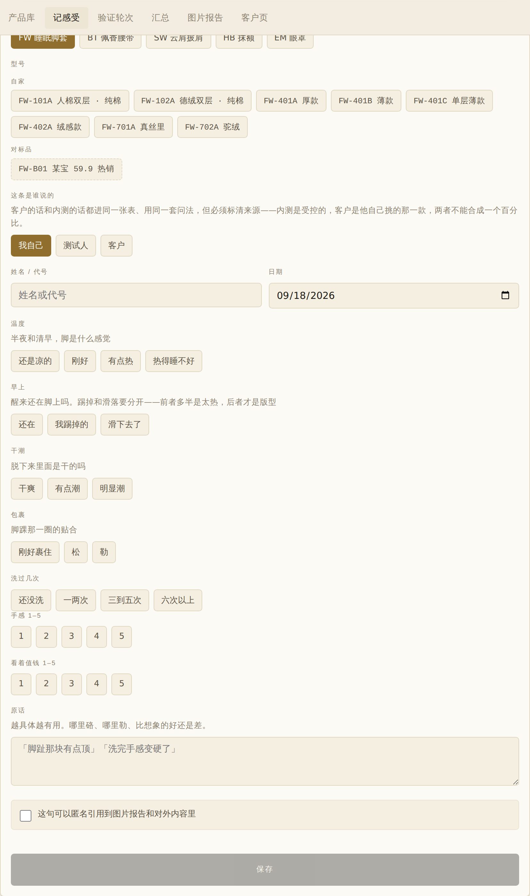
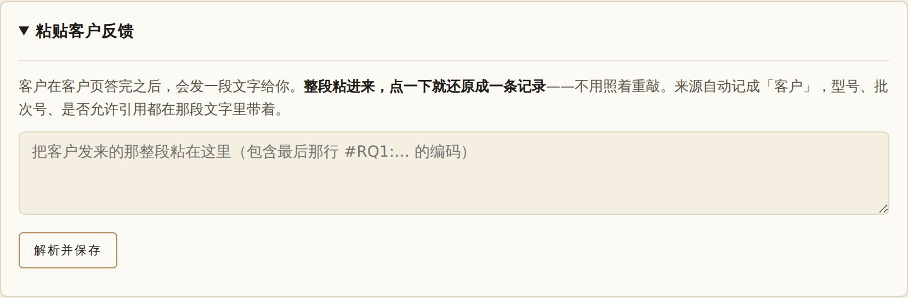
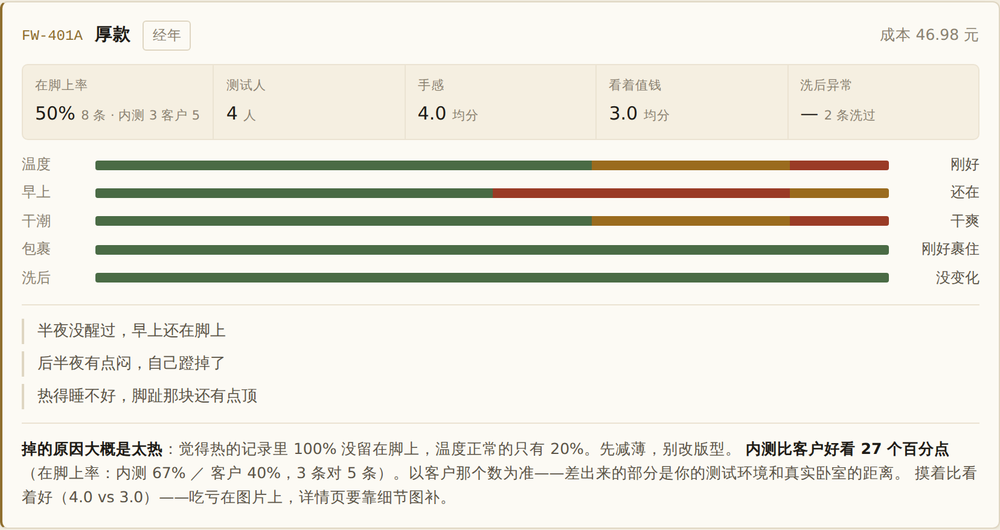
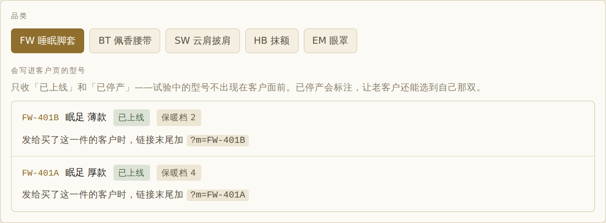
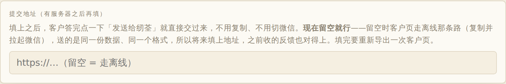
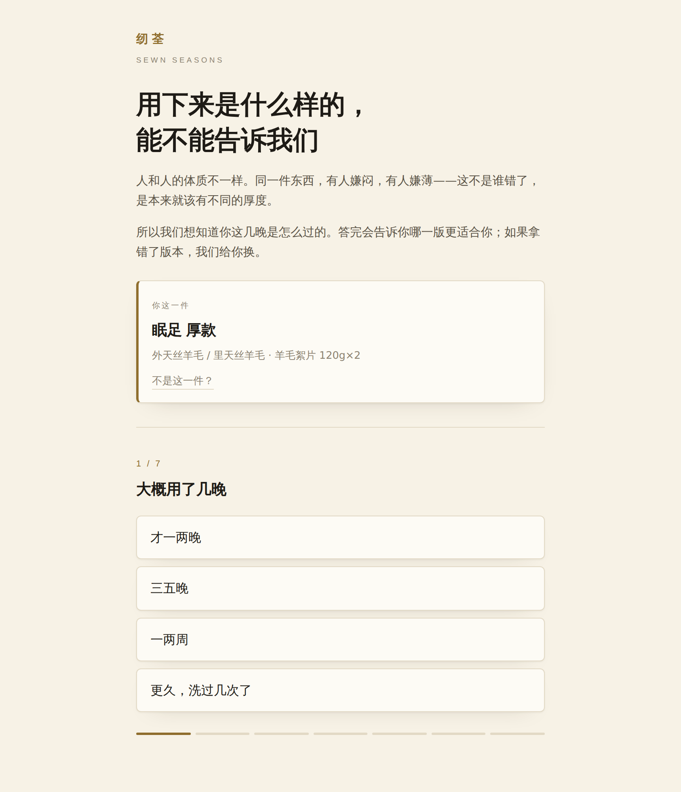
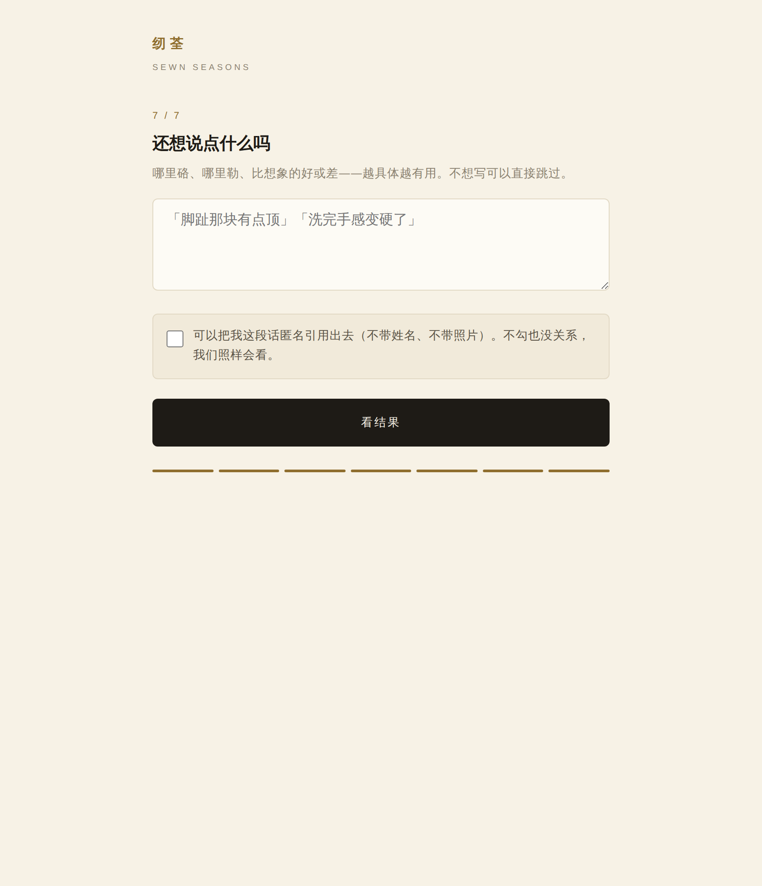
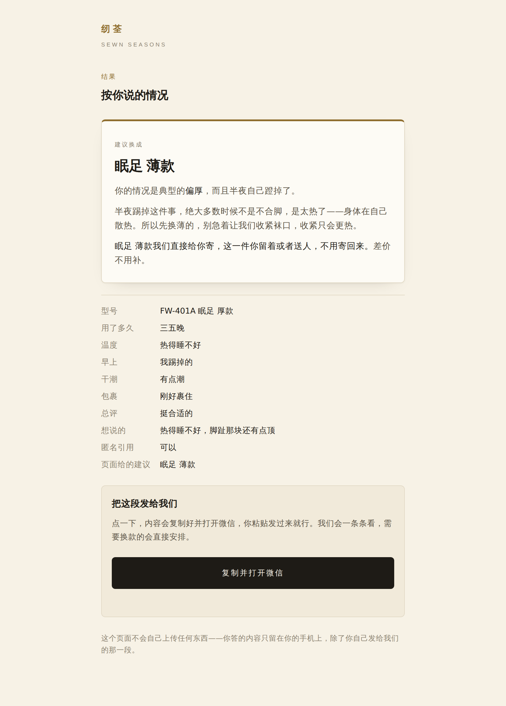

# 纫荃感受测试台 · 使用手册

> 这份文件分三块，按需要看：
>
> - **第一块 · 设计思路**——为什么做成这样。读一遍就够，读完你会知道每个按钮背后在防什么。
> - **第二块 · 保姆教程**——具体怎么点。用的时候回来查。
> - **第三块 · 常见问题**——出状况时翻这里。

---

# 第一块 · 设计思路

## 1. 这个东西到底解决什么

一句话：**把"我觉得这款不错"变成"这款在脚上率 50%，8 条里客户占 5，客户那头只有 40%"。**

再具体一点，它承接三件事：

| 它做的事 | 不做会怎样 |
|---|---|
| 给每个型号一个**永不变的身份**（编码） | 三个月后你自己也说不清"那个薄一点的天丝款"是哪一个 |
| 把所有感受装进**同一个格子**（字段契约） | 内测说"还行"、客户说"挺好"，两句话没法加在一起算 |
| **逼你在期限前出结论**（验证轮次） | 一款东西可以永远"再看看"，永远不做决定 |

第三条是最容易被忽略、但最重要的。**当判断者和被判断者是同一个人时，需要一个外部的时限约束。** 这个系统里唯一约束你、而不是伺候你的部分，就是验证轮次那一页。

## 2. 五个核心概念

不懂这五个，界面上很多设计会显得莫名其妙。花十分钟看完，后面全通。

### 概念一：品类和系列是两个方向，不是一回事

这是整套东西的地基。

| | 是什么 | 会不会变 | 进不进编码 |
|---|---|---|---|
| **系列** | 这款东西在品牌里承担什么职责（经年／采薇／生香／无双） | **会变**——产品会在系列之间生长 | **不进** |
| **品类** | 这是个什么东西（脚套／腰带／眼罩），决定要问客户什么 | 不变 | **进**，而且是编码前缀 |

**为什么系列不能进编码：** 因为经年可以有脚套，无双也可以有脚套（比如真丝里的那款）。同一个品类会出现在多个系列里。而且一款东西今天在生香试验、明天验证成功升入经年——如果系列进了编码，它一升级编码就得改，那编码就不是身份证了。

所以在产品库里，**系列是型号卡上一个可以随时改的下拉框**，改它不影响编码。

### 概念二：编码是身份证，不是说明书

```
FW-401A-II  =  FW · 4 · 01 · A · II
```

| 段 | 是什么 | 规则 |
|---|---|---|
| `FW` | 品类码 | 两个字母，永不变 |
| `4` | 材料档位 | 一位数，**由材料等级决定**，不由价格也不由系列决定 |
| `01` | 序号 | 两位数，同档位里第几个开发项目 |
| `A` | 变体 | 一个字母 |
| `II` | 代 | 罗马数字，一代不写 |

**为什么编码里只有这两样信息（品类 + 材料）？**

因为编码要在**剪第一刀的那一刻**就能发出来。那一刻你只知道两件事：这是个脚套，用的是天丝羊毛。名字还没起、卖不卖还不知道、上不上线更没影。所以编码只装这两样，**其余全部是字段**。

**由此推出五条规矩：**

1. **编码记录"它是什么"，不记录"它现在怎么样"。** 试验中／已搁置／已淘汰／已上线／已停产都是状态，都会变，都不进编码。**是否上线是状态，不是身份。**
2. **绝不复用，绝不回收。** 淘汰的型号保留编码和全部记录，只改状态并写明原因。研发管理的价值大半在失败记录里。
3. **派生看"改了哪一层"**（见概念三）。
4. **一个型号一张图。无图即未登记。**
5. **对标品走 `FW-B01`**，不占档位、不进系列、没有状态——它不是纫荃的产品。

### 概念三：派生的三条路

改一款东西的时候，先问一句"我改的是哪一层"：

| 你改了什么 | 走哪条路 | 界面上的按钮 |
|---|---|---|
| **用什么**（面料、絮片换了） | 开新序号 | `+ 同档新序号` |
| **用多少**（克重、层数、颜色） | 加变体 | `+ 加变体` |
| **怎么做**（版型、工艺改良，规格叙事不变） | 升一代 | `+ 升一代` |

**硬判据：材料清单变了就是新序号**，哪怕只换一种。所以羊毛絮片换驼绒是新序号，不是变体。

厚款 A、薄款 B 是同一个序号的变体，因为它们用的是同一套面料，只是填充克重不同。

**升代之后旧代不删**——像相机的 R5 和 R5 Mark II 并存。

### 概念四：会变的东西一律是"状态"，不进编码

五个状态：

| 状态 | 什么意思 | 出现在客户页吗 |
|---|---|---|
| 试验中 | 在做、在测 | 不 |
| 已搁置 | 暂停，但没否定（要写原因） | 不 |
| 已淘汰 | 否定了（**必须写原因**） | 不 |
| 已上线 | 在卖 | **会** |
| 已停产 | 不卖了，但老客户还有 | **会**，并标注"已停产" |

**淘汰不删记录。** 你三个月后想起"当时那个单层绗缝的为什么不做了"，答案就在那张卡上。

### 概念五：屏幕上的中文，和数据库里存的东西，不是一回事

**这一条最容易踩坑，单独说。**

测试人点了「温度 → 刚好」，存进数据库的是这个：

```json
{ "warmth": "ok" }
```

**不是** `{"温度": "刚好"}`。

- `warmth` 叫**字段 key**，`ok` 叫**选项值**——这两个是数据库里真正躺着的东西。
- 屏幕上的「温度」和「刚好」只是贴在它们上面的**标签**。

**好处：中文随便改，不影响任何旧数据。** 你哪天觉得「温度」这个词不好，改成「暖不暖」，三年前那条记录照样显示成「暖不暖：刚好」——因为数据库里一直是 `warmth: ok`，没动过。

**坏处：如果改的是 `warmth` 这个 key 本身，旧记录会安静地变成空白。** 不报错、不提示，在脚上率就从 50% 变成 "—"，分布条消失，图片报告印出来是白的。

所以规矩是 **key 永不变**。不是因为改不动，是因为改了会悄悄毁掉已有的记录。

> **现在是个特殊时刻：`records` 还是 0 条。** 没有旧记录，就没有东西会被毁。今天改这些 key 代价是零；等你记了两百条，同一个改动的代价是那两百条全部变空。品类码同理——今天改 `FW` 是改 10 个型号，上线之后改就是吊牌全废、客服记录对不上、发出去的链接全失效。

## 3. 一个系统，两端

这套东西同时是**研发工具**和**售后反馈入口**。不是两个系统。

原因很硬：**客户页的问题是从同一份字段配置生成的**。你在配置里改一个选项，内测的问法和客户的问法**同时**变——两边不可能漂移。既然问法同源，答案就落进同一个格子，客户那条记录就是第 37 条测试记录，直接进汇总、进诊断、进图片报告。

但**内测和客户不是同一种数据，必须分得开**：

- 内测是**受控**的——同一个人可以先试厚款再试薄款，变量干净。
- 客户是**观察**的——她只有她买的那一款，而且是她自己挑的（怕冷的人自己就会挑厚款）。

把两者合成一个百分比，等于把你的选品偏差算成产品性能。所以每条记录都有**来源**，汇总里分开显示。**两个数的差值本身就是最有价值的信息**——它告诉你实验室和真实卧室差在哪。

---

# 第二块 · 保姆教程

## 0. 先认门：六个页签

顶上一排：**产品库 / 记感受 / 验证轮次 / 汇总 / 图片报告 / 客户页**

按你实际会用的顺序，就是从左到右。第一次用，从产品库开始。

---

## 1. 产品库——所有东西的源头

### 它是什么

**这是唯一的数据源。** 型号在这里建、状态在这里改、图片在这里传。汇总、图片报告、客户页全都是从它生成的产物，**不是你要维护的第二处**。

### 顶上那条提示



这条会告诉你三件事，按严重程度排：

1. **同时在试 N / 上限 8**——超了会飘红。超了不是"记录不够"，是**同时开的太多**。你一个人一台缝纫机，手是瓶颈。先给几个型号按「已搁置」。
2. **N 个型号缺图**——无图即未登记。局部改动的变体，光看规格文字三个月后你自己也认不出来。
3. 都没问题时，显示"本品类 N 个型号，N 个在试，都有图"。

### 一张型号卡长什么样



**从上往下：**

| 位置 | 是什么 | 要不要填 |
|---|---|---|
| 左边方框 | 图片。**点它就能上传** | 必须 |
| `FW-101A` + 状态标签 | 编码和当前状态 | 自动 |
| `眠足 · FW-101A（未上线，还没有对外全称）` | 对外全称。**未上线的型号没有对外全称**，系统不给试验体编假身份 | 自动 |
| `品类 FW 档位 1 基础 序号 01 变体 A 一代 0 条记录` | 把编码拆开念一遍，给你核对用 | 自动 |
| **状态** | 五选一。选「已淘汰」或「已搁置」时会多出一个"原因"框，**必须写** | 要 |
| **保暖档 1–5** | 客户页靠它算"往下推一档／往上推一档"。**不填就导不出客户页** | 上线前必填 |
| **产品名 / 变体名** | 「眠足」「厚款」。对外全称由它们拼出来 | 上线前必填 |
| **内部别名** | 只给你自己看的土话，比如"人棉双层·纯棉 240g" | 建议填 |
| **总成本 元** | 你自己算的成本 | 建议填 |
| **系列（可改）** | 经年／采薇／生香／无双。**随时能改，不影响编码** | 要 |
| **规格** | 面料和絮片的完整描述 | 必须 |

**底下四个按钮：**

- `+ 加变体` —— 同版型同面料，只改填充克重／层数／颜色
- `+ 升一代` —— 版型或工艺改良，规格叙事不变
- `+ 同档新序号` —— 面料组合变了
- `删除` —— **只给"刚建错、还没记过东西"用**。有记录的型号删不掉（会提示你改状态）；没记录的也要二次确认

> **为什么删除卡得这么死：** 序号是按"现有最大值 +1"算的。删掉某个档位里最后一个型号，下一个新建就会拿到同一个序号——编码就被复用了，而这跟"绝不复用、绝不回收"直接冲突。

### 新建一个型号


**三步：**

1. **先选材料档位**（1–9）。1–3 基础／4–6 进阶／7–9 珍贵。**看材料，不看价格。**
2. 点 `+ 新建自家型号`。序号自动取该档位的下一个，变体从 A 开始。
3. 在新出现的卡上填规格、传图、改系列。

**`+ 新建对标品`** 用来登记别人家的产品（`FW-B01`、`FW-B02`…）。对标品不占档位、不进系列、没有状态，卡片是虚线框。**它和自家产品用完全一样的问法记感受**——只有同一套问法，比较才成立。

**`载入脚套现有 8 组`** 只在脚套品类下出现，一键把已有的八组建进去。已经存在的不会重复建。

### 灰掉的品类

云肩披肩、抹额、眼罩现在是**占位**，新建按钮是灰的，下面有一行红字。

原因：**品类码是编码前缀，一启用就永久占用，按"绝不回收"也收不回来。** 所以得先把码和字段定下来，才能开。手滑建一个 `SW-401A`，这个码就永远废在那儿了。

---

## 2. 记感受——数据从这里进来



### 一条记录怎么记

从上往下点就行：

1. **品类** —— 选 FW
2. **型号** —— 自家的排在前面，对标品是虚线框
3. **这条是谁说的** —— 我自己／测试人／客户（**这个很重要，见下**）
4. **姓名 / 代号** —— 填了才算一个"测试人"，汇总里会数人头
5. **日期** —— 默认今天
6. **中间那几组按钮**（温度／早上／干潮／包裹）—— 这几组是**跟着品类走的**，换个品类问的就不一样了
7. **洗过几次** —— 选了"还没洗"以外的，会自动多出一组"洗过之后"
8. **手感 1–5 / 看着值钱 1–5**
9. **原话** —— 越具体越有用。「脚趾那块有点顶」比「还行」值钱一百倍
10. **可引用勾选框** —— 勾了才会出现在图片报告和对外内容里

**全部必选项填完，「保存」才会亮。**

### 关于「这条是谁说的」

| 选项 | 什么时候用 |
|---|---|
| 我自己 | 你自己试的 |
| 测试人 | 你找的人试的（朋友、内测） |
| 客户 | 真实买了的人反馈的 |

选错不会报错，但会让汇总里的数字失去意义——**因为客户数据和内测数据在方法论上不是一回事**（见设计思路第 3 节）。

### 粘贴客户反馈（不用手敲）



客户在客户页答完，会发一段文字给你。**整段粘进这个框，点一下就还原成一条记录**——型号、原话、是否允许引用全带着，来源自动记成「客户」。

**要粘整段**，包括最后那行 `#RQ1:` 开头的编码——那行是机器读的，人不用管。

它会帮你挡住几种错：

- 编码认不出来 → 提示你让客户重发整段
- 型号在产品库里不存在 → 拒绝保存
- 同一天、同型号、同样的原话已经有一条 → 问你是不是重复了

### 下面的「最近的记录」

倒序显示最近 40 条。每条上面有型号、谁说的、来源标签、各项答案的彩色小标签、日期、原话。右边有个「删」。

---

## 3. 验证轮次——这一页是用来管你的


### 它在干什么

主纲第六节的两条约束，做成了界面：

> ① **时限**——每一轮验证须设定完成日期，到期必须出结论：做、不做、或再验一轮并写明再验什么。
> ② **判据**——"是否存在值得付费的缺口"最终由**真实付费**验证，不由主理人的个人体验单独判定。

### 怎么开一轮

1. 选品类
2. **写一个能被"是／否"回答的问题**。写"继续研究脚套"是无效的；写"59.9 元的头部产品是不是已经是让人充分满意的一百分产品"才是有效的
3. 填**完成日期**
4. 填**已有真实付费笔数**（没有就填 0，界面会提醒你判据②要求由真实付费验证）

### 到期了会怎样

**逾期的轮次会一直红着，不会自己消失。** 卡片上写着"已逾期 N 天，必须出结论"。

出结论有三个按钮：**做 / 不做 / 再验一轮**。

- 选「再验一轮」**必须在上面的框里写清再验什么**，不写点不动——这是主纲的约束，不是软件加的。
- 出完结论可以「撤销结论」，轮次回到未结状态。

---

## 4. 汇总——看数字



### 一张卡怎么读

**顶上一行：** 编码 · 名字 · 系列标签（对标品是「对标品」标签）· 成本或售价

**五个指标格：**

| 格子 | 意思 |
|---|---|
| **在脚上率** | 主指标。这是脚套的主指标，别的品类是别的（佩香腰带是"香气合适率"）。**下面小字写着来源构成：`8 条 · 内测 3 客户 5`** |
| 测试人 | 几个不同的人给过反馈 |
| 手感 / 看着值钱 | 1–5 的均分 |
| 洗后异常 | 报了"结块"或"缩水"的条数 |

**中间的彩条：** 每个字段的答案分布。绿＝好、黄＝中、红＝差。右边写着占比最高的那个答案。

**下面引号里的：** 原话，最多三条。

**最底下那段带粗体的：** 系统的诊断。

### 诊断会说什么

它只在数据够的时候才开口，条件不够就说"才 N 条，还看不出东西"。够了之后可能说：

- **内测和客户分歧**——"内测比客户好看 27 个百分点。以客户那个数为准——差出来的部分是你的测试环境和真实卧室的距离。"
- **掉的原因**——区分"太热"和"版型"。觉得热的记录里掉得多 → 先减薄；温度正常也掉 → 改袜口或后跟弧线
- **洗后结构性问题**——两条以上报结块或缩水，就不是调克重能解决的
- **样本太单薄**——记录只来自一两个人，体质差异没覆盖到
- **对标品不输给你**——按主纲的验证门槛，缺口还没被证明存在，这一款要么继续改，要么不做
- **摸着和看着的落差**——摸着好看着差 → 吃亏在图片上；看着好摸着差 → 盯退货率

**「系列」那一排是可选筛选**，只想看经年的就点经年。对标品不受筛选影响，始终排在一起，方便比。

---

## 5. 图片报告——生成对外长图

选品类 → 选型号（**只能选自家的**）→ 点「生成长图」。

出来的是 1080 宽的长图，印：品牌 · 系列 · 品类 → 对外全称 → 产品图 → 规格 → 主指标大数字 → 各项分布条 → **勾了"可引用"的原话** → 日期和免责行。

**两条硬规则，都是有理由的：**

1. **只印勾了「可引用」的原话。** 没勾的一律不印。
2. **不给对标品出报告。** 把别人的产品数据印进自己的宣传，是《广告法》里贬低同行和引证他人数据的红线。

底部固定印一行：**"仅为本次测试的实际记录，非统计调查结果"**。

> 未上线的型号也能出报告，但会标注「试验中，未上线」——不会假装它已经是产品。

---

## 6. 客户页——发给客户的那一页

### 上半部分：谁会进客户页



**只收「已上线」和「已停产」的型号。** 试验中的不出现在客户面前；已停产会标注，让老客户还能选到自己那双。

每个型号后面写着它的**链接后缀**。有型号没填保暖档，会飘红，而且**导出按钮是灰的**——因为客户页靠它算"往下推一档"，不填就推不出来。

### 下半部分：提交地址



**现在留空就行。** 留空时客户页走离线那条路；等你以后有了服务器，把地址填进来、重新导出一次，客户就能直接提交了。

**两条路送的是同一份数据、同一个格式**，所以将来填上地址，之前收回来的反馈也完全对得上，不会出现"上线前的数据用不了"。

### 导出

点「生成并下载客户页」，拿到一个 html 文件。扔到你自己的空间，就是一个能发给客户的网页。

### 发给客户时：链接末尾必须带型号

```
https://你的地址/feedback.html?m=FW-401A
                                └───────┘
                                  型号编码
```

**一个型号一条链接，不是一单一条。** 同一款发给一百个客户用的是同一条，不用每单拼。

**为什么必须带：** 不带的话，页面会退回让客户自己从列表里挑，而**她大概率会挑错**——厚款薄款用了三个月她看不出差别。挑错的记录**比没有记录更糟**，因为它会挂到错误的型号上，把那一款的数字污染掉，而你看不出来。

### 客户看到的是这样

**第一屏——确认是哪一件：**



链接里带了型号，所以直接显示「你这一件：眠足 厚款」。留了一个「不是这一件？」的出口，万一发错货客户能自己改。

**答题——一次一题：**



问法和你内测用的**完全一样**（用的是同一份配置里的"客户问法"）。七道题，点一下自动翻页。

**结果——给她一个说法：**



页面会**按她的答案给出建议**，不是一句"谢谢反馈"：

| 她的情况 | 页面会说 |
|---|---|
| 觉得热，或者半夜踢掉了 | 建议换薄一档，**直接寄，旧的不用寄回来，差价不补** |
| 已经是最薄的还嫌热 | 不硬卖，先问室温和床品，不合适就退款 |
| 觉得冷 | 建议换厚一档 |
| 温度刚好但滑下去了 | **厚薄是对的，版型要改**，记进改版清单，下一版先寄她 |
| 温度刚好但发潮 | 排湿问题，有更透气的版本在测，做好寄她 |
| 各项都合适 | 不用换，这版跟她的体质是配的 |
| 东西坏了 | 不是版本问题，换新 + 运费我们出，不想试直接退款 |

底下是她答的内容摘要，和一个「复制并打开微信」按钮（填了提交地址就变成「发送给纫荃」）。

---

# 第三块 · 常见问题

### 数据存在哪？换个手机会丢吗？

- **在 artifact 里运行时**：存在云端数据库，换设备接着记。顶上会显示"已连接云端"。
- **单独打开 html 文件时**：只存在**这台设备的这个浏览器**里。顶上会飘黄字提醒你。换浏览器、清缓存就没了。

**所以：日常记录请用 artifact 那一份，别用单独的 html 文件记。** 单独的 html 是给我改代码用的副本。

### 我删了个型号，能找回来吗？

**不能。** 所以有记录的型号系统直接不让删，没记录的也要二次确认。

**要停掉一个型号，正确做法是把状态改成「已淘汰」并写明原因**，不是删。研发管理的价值大半在失败记录里。

### 为什么「新建自家型号」是灰的？

你选的是占位品类（云肩披肩／抹额／眼罩）。它们的码还没定稿，建不了型号——防止手滑烧掉一个永久编码。

### 为什么客户页导不出来？

有型号没填**保暖档 1–5**。回产品库补上。客户页的换款推荐全靠它。

### 图片传不上去

单独打开 html 文件时上传是关的（没有云存储）。**用 artifact 那一份。**

### 我改了问题的中文说法，旧记录会坏吗？

**不会。** 屏幕上的中文只是标签，数据库里存的是英文 key。改「温度」为「暖不暖」，三年前的记录照样正确显示。

**但如果改的是 key 本身**（`warmth` 改成别的），旧记录会安静地变成空白。这个改动要找我做，不要自己改。

### 主指标那一格为什么显示 "—"

这个型号还没有记录，或者记录里主指标那个字段没填。

### 汇总里为什么没有诊断

记录不到 3 条时不出诊断，只说"才 N 条，还看不出东西"。**这是故意的**——三条记录得出的结论比没有结论更危险。

### 客户发来的那段粘不进去

八成是只复制了一部分。**要整段**，包括最后那行 `#RQ1:` 开头的长编码。让客户重发一次。

---

# 附：名词对照

| 界面上叫 | 数据库里叫 | 说明 |
|---|---|---|
| 材料档位 | `grade` | 1–9，进编码 |
| 保暖档 / 香气浓度档 | `rank` | 1–5，客户页推荐用，**不进编码** |
| 序号 | `seq` | 两位数，同档位内 |
| 变体 | `variant` | 一个字母 |
| 代 | `gen` | 罗马数字，一代不写 |
| 状态 | `status` | test / shelved / dropped / live / retired |
| 淘汰原因 | `why` | |
| 来源 | `source` | self / tester / customer |
| 可引用 | `quotable` | |
| 对标品 | `kind: "bench"` | 编码走 `FW-B01` |

> **材料档位（1–9）和保暖档（1–5）是两个不同的东西**，界面上都叫"档"，容易混。
> 材料档看的是**用什么料**，进编码，永不变。
> 保暖档看的是**穿上什么感觉**，不进编码，随时能改，客户页靠它推荐。

---

# 附：要动代码才能改的部分

这些在 `<script>` 最开头那一块（方框注释圈出来的 `CONFIG`）里，改起来不难，但**建议找我改**，因为有些改动会静悄悄破坏旧数据。

| 想改什么 | 在哪 | 风险 |
|---|---|---|
| 加一个新品类 | `CONFIG.categories` | 低。加一段配置，六个页签自动跟着变 |
| 改某个问题的中文说法 | 对应字段的 `label` / `ask` / `sub` | **无风险**，旧记录不受影响 |
| 改客户看到的问法 | 字段的 `ask` | 无风险 |
| 加／删一个选项 | 字段的 `options` | 删选项有风险——选过它的旧记录会显示不出来 |
| 改字段 key | 字段的 `key` | **高风险**，旧记录会变空白 |
| 改品类码 | 品类的 `code` | **极高风险**，所有编码都变，吊牌和客服记录全对不上 |
| 同时在试的上限 | `CONFIG.wipLimit` | 无风险 |
| 客户反馈提交地址 | 界面上「客户页」页签里直接填 | 无风险 |

---

*本手册对应的代码版本：见仓库 `renquan-feel-lab.html`。界面改了记得回来更新这份。*
